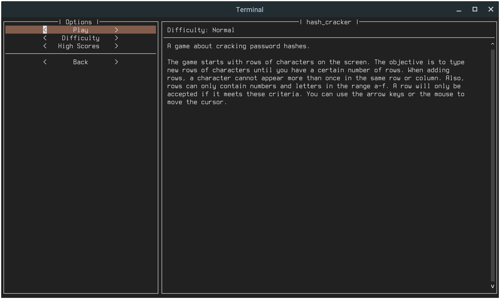

# skiddie
skiddie is a collection of minigames that can be played in the terminal and are
meant to emulate Hollywood-style "hacking." These games have nothing to do with
cybersecurity. Instead, they're just small puzzle games themed around the
hacking scenes found in many movies.

## Features
* No knowledge of programming or cybersecurity required.
* Multiple difficulty settings for each game.
* Tracks your scores in a leaderboard.
* Works on all platforms.

## Usage
skiddie comes with a terminal-based graphical user interface. To launch it,
just open a terminal and type `skiddie`. To use the interface, use the keys
`Up`, `Down` and `Tab` to navigate, `Enter` to select and `q` to quit.

skiddie also comes with a command-line interface. For more information, run
`skiddie --help`.

## Games

Game | Description | Screenshot
--- | --- | ---
**hash_cracker** | [Description](skiddie/descriptions/hash_cracker.md) | [Screenshot](images/hash_cracker.png)
**hex_editor** | [Description](skiddie/descriptions/hex_editor.md) | [Screenshot](images/hex_editor.png)
**pattern_finder** | [Description](skiddie/descriptions/pattern_finder.md) | [Screenshot](images/pattern_finder.png)
**port_scanner** | [Description](skiddie/descriptions/port_scanner.md) | [Screenshot](images/port_scanner.png)
**shell_scripter** | [Description](skiddie/descriptions/shell_scripter.md) | [Screenshot](images/shell_scripter.png)
